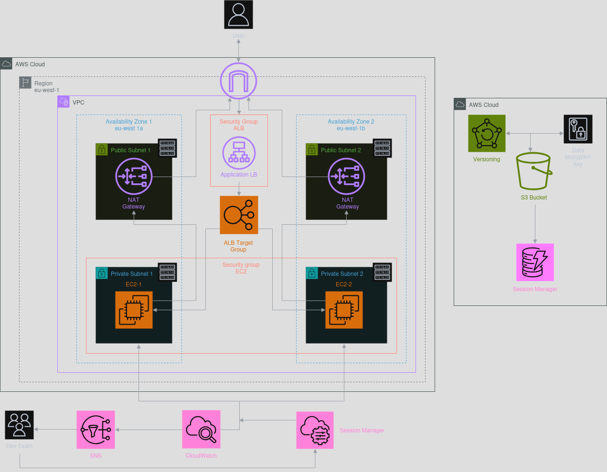

# Terraform AWS Infostructure - Trustsoft Internship Project

# Project Overview

This project uses **Terraform** to provision an AWS environment, broken into logical modules for clarity and reuse.

---

# Architecture diagram


---

## Networking

- **VPC** with public and private subnets across two AZs 
- **Internet Gateway** for public-facing traffic  
- **NAT Gateways** (one per AZ) to allow private EC2 instances outbound Internet access without public IPs  
- Route tables and associations connecting all pieces

### 1. Public Route Table (`public_subnet_rt`)

- **Associated with:**  
  - `public_subnet_1` (AZ‑1)  
  - `public_subnet_2` (AZ‑2)  

- **Routes:**  
  
| Destination   | Target             | Purpose                                         |
  |---------------|--------------------|-------------------------------------------------|
  | `0.0.0.0/0`   | Internet Gateway   | Allows inbound Internet traffic to ALB, NAT GWs |
  | `local`       | `–` (VPC router)   | Enables inside‑VPC communication                |

### 2. Private Route Table AZ‑1 (`private_subnet_rt_1`)

- **Associated with:**  
  - `private_subnet_1` (AZ‑1)  

- **Routes:**  

  | Destination   | Target                         | Purpose                                        |
  |---------------|--------------------------------|------------------------------------------------|
  | `0.0.0.0/0`   | NAT Gateway 1 (`nat_gw_1`)     | Allows EC2 in private subnet to reach Internet |
  | `local`       | `–` (VPC router)               | Enables inside‑VPC communication               |

### 3. Private Route Table AZ‑2 (`private_subnet_rt_2`)

- **Associated with:**  
  - `private_subnet_2` (AZ‑2)  

- **Routes:**

  | Destination   | Target                         | Purpose                                        |
  |---------------|--------------------------------|------------------------------------------------|
  | `0.0.0.0/0`   | NAT Gateway 2 (`nat_gw_2`)     | Allows EC2 in private subnet to reach Internet |
  | `local`       | `–` (VPC router)               | Enables inside‑VPC communication               |


---

## Security

- **Security Groups**  
  - ALB SG: allows HTTP from the Internet  
  - EC2 SG: allows HTTP only from the ALB  
- **IAM Role** + **Instance Profile**  
  - Grants EC2 instances permission for **SSM Session Manager** (no SSH keys needed)

---

## Compute & Load Balancing

- Two **EC2** instances in different private subnets  
  - Bootstrapped via `user_data` to install Web Server and register with SSM  
- An **Application Load Balancer** in public subnets  
  - Distributes HTTP traffic to EC2 instances  
  - Performs health checks on a `/` endpoint
- **Target Group**
  - Defines which backend targets receive traffic
---

## Monitoring

- **CloudWatch Agent** on EC2 for logs and custom metrics  
- **CloudWatch Alarms** monitoring CPU utilization  
- **SNS Topic** for email alerts to a configurable list of recipients

---

## Remote backend
- Remote state stored in **S3** (with versioning and SSE-KMS encryption)  
- State locking **without DynamoDB** using S3 native locking

---

## IaC
```
├── backend.tf                # Remote backend configuration (S3 + DynamoDB)
├── versions.tf               # Terraform & provider version constraints
├── variables.tf              # Root-module input variable definitions
├── outputs.tf                # Root-module outputs that expose module results
├── main.tf                   # Calls all child modules
├── bootstrap/                # Create backend infrastructure (S3 bucket, DynamoDB, KMS)
│   └── backend-setup.tf      # Resources for S3, DynamoDB, KMS key
├── modules/                  # Reusable modules, each with its own variables/outputs
│   ├── networking/           # Module for VPC, subnets, IGW, NAT, route tables
│   │   ├── main.tf           
│   │   ├── variables.tf      # Inputs: vpc_cidr, subnet CIDRs, AZs
│   │   └── outputs.tf        # Outputs: vpc_id, subnet IDs, igw_id, nat_gw_ids, rt_ids
│   ├── security/             # Module for security groups (ALB & EC2)
│   │   ├── main.tf
│   │   ├── variables.tf      # Inputs: vpc_id, alb_cidr_blocks
│   │   └── outputs.tf        # Outputs: alb_sg_id, ec2_sg_id
│   ├── iam/                  # Module for IAM roles & instance profiles
│   │   ├── main.tf
│   │   ├── variables.tf      
│   │   └── outputs.tf        # Outputs: role_arn, instance_profile
│   ├── compute/              # Module for EC2 instances
│   │   ├── main.tf
│   │   ├── variables.tf      # Inputs: ami_id, instance_type, subnet_ids, SGs, iam_instance_profile, user_data_file
│   │   └── outputs.tf        # Outputs: instance_ids, private_ips
│   ├── alb/                  # Module for Application Load Balancer & target group
│   │   ├── main.tf
│   │   ├── variables.tf      # Inputs: vpc_id, public_subnet_ids, security_group_id, target_ids
│   │   └── outputs.tf        # Outputs: alb_dns_name, target_group_arn
│   └── monitoring/           # Module for CloudWatch alarms & SNS notifications
│       ├── main.tf
│       ├── variables.tf      # Inputs: instance_ids, email_addresses
│       └── outputs.tf        # Outputs: sns_topic_arn
├── scripts/                  # Helper scripts and user_data files
└────── userdata.sh           # Bootstraps EC2 with Web Server and   SSM
```

---

# Deploying
```
terraform init     # Initializes backend
terraform plan     # Shows what will be created
terraform apply    # Deploys resources
```

> **Warning: Create a backend before deploying! Go to the `bootstrap/` folder and do the same steps.**

---

# Cleaning Up
```
terraform destroy
```

---

# Documentation generated using [terraform-docs](https://terraform-docs.io/).

> **Each module has its own documentation within its folder generated via [terraform-docs](https://terraform-docs.io/).**

## Requirements

| Name                                                                       | Version  |
|----------------------------------------------------------------------------|----------|
| <a name="requirement_terraform"></a> [terraform](#requirement\_terraform)  | >= 1.5.0 |
| <a name="requirement_aws"></a> [aws](#requirement\_aws)                    | ~> 5.81  |

## Providers


| Name | Version |
|------|---------|
| <a name="provider_aws"></a> [aws](#provider\_aws) | 5.81.0 |

## Modules

| Name | Source | Version |
|------|--------|---------|
| <a name="module_alb"></a> [alb](#module\_alb) | ./modules/alb | n/a |
| <a name="module_compute"></a> [compute](#module\_compute) | ./modules/compute | n/a |
| <a name="module_iam"></a> [iam](#module\_iam) | ./modules/iam | n/a |
| <a name="module_monitoring"></a> [monitoring](#module\_monitoring) | ./modules/monitoring | n/a |
| <a name="module_networking"></a> [networking](#module\_networking) | ./modules/networking | n/a |
| <a name="module_security"></a> [security](#module\_security) | ./modules/security | n/a |

## Resources

No resources.

## Inputs

| Name | Description | Type | Default | Required |
|------|-------------|------|---------|:--------:|
| <a name="input_alb_allowed_cidrs"></a> [alb\_allowed\_cidrs](#input\_alb\_allowed\_cidrs) | List of CIDR blocks permitted to connect to the ALB | `list(string)` | <pre>[<br/>  "0.0.0.0/0"<br/>]</pre> | no |
| <a name="input_ami_id"></a> [ami\_id](#input\_ami\_id) | AMI ID to use for EC2 instances | `string` | `"ami-0ce8c2b29fcc8a346"` | no |
| <a name="input_availability_zones"></a> [availability\_zones](#input\_availability\_zones) | List of Availability Zones to distribute subnets and NAT Gateways | `list(string)` | <pre>[<br/>  "eu-west-1a",<br/>  "eu-west-1b"<br/>]</pre> | no |
| <a name="input_backend_bucket"></a> [backend\_bucket](#input\_backend\_bucket) | Name of the S3 bucket used to store Terraform state | `string` | `"s3-remote-backend-internship-maksym"` | no |
| <a name="input_backend_dynamodb_table"></a> [backend\_dynamodb\_table](#input\_backend\_dynamodb\_table) | Name of the DynamoDB table used for Terraform state locking | `string` | `"dynamodb-state-lock-table-internship-maksym"` | no |
| <a name="input_email_addresses"></a> [email\_addresses](#input\_email\_addresses) | List of email addresses to receive CloudWatch alarm notifications | `list(string)` | <pre>[<br/>  "maksym.suvorov@trustsoft.eu"<br/>]</pre> | no |
| <a name="input_instance_type"></a> [instance\_type](#input\_instance\_type) | EC2 instance type | `string` | `"t2.micro"` | no |
| <a name="input_private_subnet_cidrs"></a> [private\_subnet\_cidrs](#input\_private\_subnet\_cidrs) | List of CIDR blocks for private subnets | `list(string)` | <pre>[<br/>  "10.0.11.0/24",<br/>  "10.0.12.0/24"<br/>]</pre> | no |
| <a name="input_public_subnet_cidrs"></a> [public\_subnet\_cidrs](#input\_public\_subnet\_cidrs) | List of CIDR blocks for public subnets | `list(string)` | <pre>[<br/>  "10.0.1.0/24",<br/>  "10.0.2.0/24"<br/>]</pre> | no |
| <a name="input_region"></a> [region](#input\_region) | AWS Region where all resources will be created | `string` | `"eu-west-1"` | no |
| <a name="input_user_data_file"></a> [user\_data\_file](#input\_user\_data\_file) | Path to the bootstrap script for EC2 | `string` | `"scripts/userdata.sh"` | no |
| <a name="input_vpc_cidr"></a> [vpc\_cidr](#input\_vpc\_cidr) | CIDR block for the VPC | `string` | `"10.0.0.0/16"` | no |

## Outputs

| Name | Description |
|------|-------------|
| <a name="output_alb_dns_name"></a> [alb\_dns\_name](#output\_alb\_dns\_name) | DNS name of the Application Load Balancer |
| <a name="output_alb_sg_id"></a> [alb\_sg\_id](#output\_alb\_sg\_id) | Security Group ID for the Application Load Balancer |
| <a name="output_ec2_sg_id"></a> [ec2\_sg\_id](#output\_ec2\_sg\_id) | Security Group ID for EC2 instances |
| <a name="output_instance_ids"></a> [instance\_ids](#output\_instance\_ids) | List of EC2 instance IDs |
| <a name="output_instance_profile"></a> [instance\_profile](#output\_instance\_profile) | Name of the IAM Instance Profile attached to EC2 |
| <a name="output_internet_gateway_id"></a> [internet\_gateway\_id](#output\_internet\_gateway\_id) | ID of the Internet Gateway |
| <a name="output_nat_gateway_ids"></a> [nat\_gateway\_ids](#output\_nat\_gateway\_ids) | List of NAT Gateway IDs |
| <a name="output_private_ips"></a> [private\_ips](#output\_private\_ips) | Private IP addresses of the EC2 instances |
| <a name="output_private_subnet_ids"></a> [private\_subnet\_ids](#output\_private\_subnet\_ids) | List of private subnet IDs |
| <a name="output_public_subnet_ids"></a> [public\_subnet\_ids](#output\_public\_subnet\_ids) | List of public subnet IDs |
| <a name="output_role_arn"></a> [role\_arn](#output\_role\_arn) | ARN of the IAM role for EC2 instances |
| <a name="output_sns_topic_arn"></a> [sns\_topic\_arn](#output\_sns\_topic\_arn) | ARN of the SNS topic for CloudWatch alerts |
| <a name="output_target_group_arn"></a> [target\_group\_arn](#output\_target\_group\_arn) | ARN of the ALB target group |
| <a name="output_vpc_id"></a> [vpc\_id](#output\_vpc\_id) | ID of the created VPC |