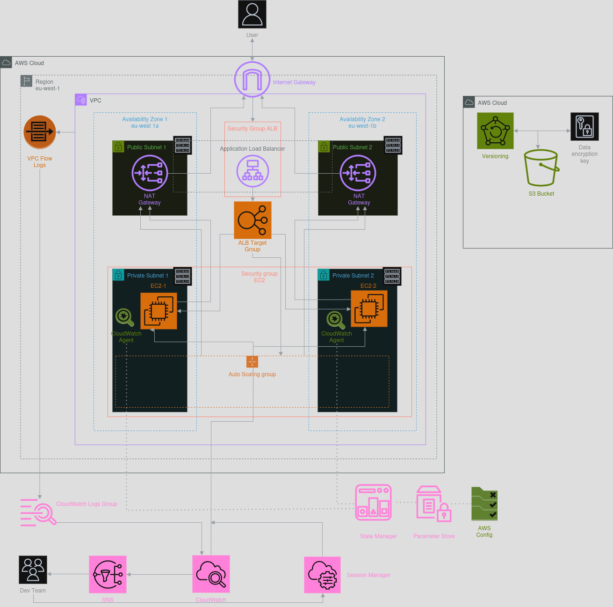

# Terraform AWS Infrastructure - Trustsoft Internship Project

## Project Overview

> This project uses **Terraform** to provision an AWS environment, broken into logical modules for clarity and reuse.

> This infrastructure includes resources like EC2, ALB, NAT Gateways, and CloudWatch. Costs may vary depending on region and usage. Consider using AWS Free Tier or budget alerts.


1. [Architecture Diagram](#architecture-diagram)
2. [Basic AWS Infrastructure](#252025)
3. [CloudWatch Metrics](#552025)
4. [EC2 Instances Troubleshooting](#652025)
5. [Auto Scaling Group + Testing](#752025)
6. [IaC. Project Structure](#iac)
7. [Deploying Infrastructure](#deploying)
8. [Cleaning Up Infrastructure](#cleaning-up)
9. [Testing the Infrastructure](#testing)
10. [CI/CD](#cicd)
11. [Documentation via terraform-docs](#documentation-generated-using-terraform-docs)

---

## Architecture diagram


---
### 2.5.2025

## Networking

- **VPC** with public and private subnets across two AZs.
- **Availability Zones (AZs):** 2 ( eu-west-1a, eu-west-1b).
- **Internet Gateway** provides internet access to resources in **public subnets**.
  - Referenced in the public route table
- **NAT Gateways** (one per AZ) allow instances in **private subnets** to:
  - Access the internet
  - Remain unreachable from the public internet
- Route tables and associations are connecting all pieces.

### 1. Public Route Table (`public_subnet_rt`)

- **Associated with:**  
  - `public_subnet_1` (AZ‑1)  
  - `public_subnet_2` (AZ‑2)  

- **Routes:**  
  
  | Destination | Target           | Purpose                                         |
  |-------------|------------------|-------------------------------------------------|
  | `0.0.0.0/0` | Internet Gateway | Allows inbound Internet traffic to ALB, NAT GWs |
  | `local`     | `–` (VPC router) | Enables inside‑VPC communication                |

### 2. Private Route Table AZ‑1 (`private_subnet_rt_1`)

- **Associated with:**  
  - `private_subnet_1` (AZ‑1)  

- **Routes:**  

  | Destination | Target                      | Purpose                                        |
  |-------------|-----------------------------|------------------------------------------------|
  | `0.0.0.0/0` | NAT Gateway 1 (`nat_gw_1`)  | Allows EC2 in private subnet to reach Internet |
  | `local`     | `–` (VPC router)            | Enables inside‑VPC communication               |

### 3. Private Route Table AZ‑2 (`private_subnet_rt_2`)

- **Associated with:**  
  - `private_subnet_2` (AZ‑2)  

- **Routes:**

  | Destination | Target                      | Purpose                                        |
  |-------------|-----------------------------|------------------------------------------------|
  | `0.0.0.0/0` | NAT Gateway 2 (`nat_gw_2`)  | Allows EC2 in private subnet to reach Internet |
  | `local`     | `–` (VPC router)            | Enables inside‑VPC communication               |


---

## Security

- **Security Groups**  
  - ALB SG: allows HTTP from the Internet  
  - EC2 SG: allows HTTP only from the ALB
  - IAM roles and policies used in this project are scoped only to **required permissions**.
  - EC2 instances do not require or expose SSH access. 
    - Management and troubleshooting are handled entirely via **AWS Systems Manager Session Manager**.

---

## Compute & Load Balancing

- Two **EC2** instances in different private subnets  
  - Bootstrapped via `user_data` to install Web Server and register with SSM  
- An **Application Load Balancer** in public subnets  
  - Distributes HTTP traffic to EC2 instances  
  - Performs health checks on a `/` endpoint
- **Target Group**
  - Defines which backend targets receive traffic
---

## Monitoring

- **CloudWatch Agent** on EC2 for logs and custom metrics  
- **CloudWatch Alarms** monitoring CPU utilization  
- **SNS Topic** for email alerts to a configurable list of recipients
> **Potential Improvements:**
> - Refactor alarm resources to use `for_each` for easier scaling and modularity. 
> - Automate the creation of multiple alarms with a `map` variable to reduce code duplication. 

---

## Remote backend
- Remote state stored in **S3** (with versioning and SSE-KMS encryption).
  - **Versioning** enables recovery from accidental changes.
  - **SSE-KMS** encryption encrypts state files at rest using customer-managed keys.
- State locking **without DynamoDB** using S3 native locking.


### 5.5.2025

## VPC Flow Logs into CloudWatch
- Enabled VPC Flow Logs for the entire VPC.
- CloudWatch Logs group with a retention period set to **3 days**.

## EC2 CloudWatch Agent
- Installed CloudWatch Agent on EC2 instances via SSM.
- **Ansible** script inside SSM Document 
  - Installs the **CloudWatch Agent** 
  - **Fetches the config** from Parameter Store 
  - Starts the **agent**
- Monitored Metrics: `mem_used_percent`, `disk_used_percent`.
- Config stored in **SSM Parameter Store**, preventing sensitive information (like credentials or internal metrics config) from being stored in plain text within Terraform code or `user_data`.
- Installed via **SSM Document** + **Association**.
- SSm Association Automatically applies the installation document to EC2 instances tagged with `Monitoring=enabled`.

- 

## EC2 Status Check Alarm
- Ensures the instance is healthy on OS level.
- **Configured** similarly to other alarms with SNS alerting.

## AWS Config Rule – Required Tags
- Enforce consistent tagging, applied on the two EC2 instances.
- Tags enforced: `Name`

### 6.5.2025

## Task 1:
> The customer is complaining that the server has high CPU usage. Try to determine what is causing the load and eliminate the problem 

- After this problem occurred, the CPU metrics monitored via **CloudWatch** have risen.


- Using `ps aux --sort=-%cpu` command I discovered that someone has run `yes` command in terminal.


- My first idea was to kill this process using `kill -9 <pid>` command. Unfortunately, right after killing the process, there was started the same command with another process ID.
- Some script was constantly running this command. Using `ps -o pid,ppid,cmd -p <id>` I have found this script.


- The PID 1 of the process often indicates that it is a system process that starts right after the boot. It was named `systemd-helper` and its name says, that it was managed by `systemd` service. The content of the file was

```shell
#!/bin/bash
yes > /dev/null
```

- I have deleted this script and killed the process. After an hour, the process was created again. So the issue was somewhere else. There was some kind of **backdoor** that was starting this script and uploading it after deletion on the EC2 instance.
- It occurred that there was a python script, named `health-check`, that was starting (uploading) the script.


- After I deleted it, killed the process, and disabled all related services, **the problem was solved.**

## Task 2:
> A customer complains that his application is not running on the server and that he cannot connect to it. Try to figure out why and fix it as follows

- After this problem had occurred, I could not connect to the EC2 instance via **SSM**. I used an AWS EC2 feature and displayed an instance screenshot.


- After checking **system logs**, I have discovered that the system was in an emergency mode.
- There was also an error message that said
```
[ TIME ] Timed out waiting for device /dev/disk/bu-uuid/11111-2222-3333-4444-555555555555.
[DEPEND] Dependency failed for /mnt/kaput.
[FAILED] Failed to mount var-lib-nfs.mount - RPC Pipe File System.
[DEPEND] Dependency failed for Local File Systems 
```
- To find the origin of this problem, I needed the access to the instance disk.
- So I created a snapshot of the instance volume via the **AWS console** and created a new volume using this snapshot. 
- Then I have created a new EC2 instance (in the same AZ used by the damaged instance) and attached the newly created volume as a **secondary** volume. After connecting to the helper instance and mounting the new volume to the new EC2 instance's FS with 

```shell
sudo mkdir /mnt/rescue
sudo mount xvf /dev/xvdf1 /mnt/rescue
```
I was trying to find what was causing the problem.

- After checking the `etc/fstub` file of the damaged instance, it occurred its content was suspicious.
- The content of the file was
```
UUID=b1e84820-06b0-4d3b-9b5d-edd836bd5895 / xfs defaults,noatime 1 1
UUID=b1e84820-06b0-4d3b-9b5d-edd836bd5895 / xfs defaults,noatime 1 1
UUID=DED7-C018 /boot/efi vfat defaults,noatime,uid=0,gid=0,umask=0077,shortname=winnt,x-systemd.automount 0 2
UUID=11111111-2222-3333-4444-555555555555 /mnt/kaput xfs defaults 0 2
```

- The first issue was that someone has mounted the same **UUID** twice to `/`, which is invalid and will cause boot failures.
- The second issue was that `mnt/kaput` does not exist in the system.
- After deleting the first and the last rows, I have unmounted the volume from the helper EC2 instance.
```shell
sudo umount /mnt/rescue
```
Then I have attached it to the damaged instance as a **root** volume. **The problem was solved.**

### 7.5.2025

## Auto Scaling Group Policies Based on CPU Utilization:
- **CloudWatch** alarms and scaling policies to automatically scale EC2 instances in or out based on average CPU utilization.
- Scale Out when:
    - Average CPU utilization > 70% for 2 minutes.
    - Adds one EC2 instance.
- Scale In when:
  - Average CPU utilization < 30% for 2 minutes.
  - Removes one EC2 instance.
- I have tested this feature running `stress --cpu $(noproc) --timeout 300` command. I have run this command on both instances inside **ASG**. Right after running `stress` command the **CloudWatch** alarmed


- After two minutes in the alarm state, CloudWatch metrics scaling policy triggered `scale out` policy and there was created another EC2 instance inside the same ASG.


- It was also successfully connected to ALB


- After I had stooped `stress` command on both instances and the CPU usage level decreased <30%, the third instance was automatically deleted.


## Auto Scaling Group Policies Based on ALB Request Count:
- AWS continuously measures how many requests each instance is serving.
- When the **average request count per instance exceeds the target threshold (one request)**, a new instance is launched to balance the load.


- I have tested this feature using [Apache Benchmark](https://httpd.apache.org/docs/2.4/programs/ab.html) utility, running `ab -n 5000 -c 50 http://<alb_dns_name>/` command on the local computer. This command sends 5000 requests (50 requests at the same time) to the ALB in a short time period. **CloudWatch** metrics have shown:


- ASG has immediately created the new EC2 instance.


## Scheduled Scaling
- Scheduled scaling allows changing the number of running instances at specific **times of day**, regardless of load.
- We can scale up the number of EC2 instances in the morning when traffic usually increases, and scale down in the evening to save costs.
- Since Terraform only supports **UTC times**, **local Prague times** must be manually converted.
- For test cases, the scaling time was set to:

| Activity      | Prague Time | UTC Time |
|---------------|-------------|----------|
| **Scale Out** | 12:25       | 10:25    |
| **Scale In**  | 12:30       | 10:30    |


>After **ASG** receives a signal to scale in the instances, it usually takes a couple of minutes to see the actual scaling.


- These scheduled actions run daily on **weekdays** unless further restricted.

> **Potential Improvements:**
> - Parameterize scheduled scaling times based on the environment (dev/staging/prod). 
> - Implement dynamic scaling policies using CloudWatch anomaly detection for smarter scale-in/out.

---

## IaC
```
├── backend.tf                # Remote backend configuration (S3 + DynamoDB)
├── versions.tf               # Terraform & provider version constraints
├── variables.tf              # Root-module input variable definitions
├── outputs.tf                # Root-module outputs that expose module results
├── main.tf                   # Calls all child modules
├── bootstrap/                # Create backend infrastructure (S3 bucket, DynamoDB, KMS)
│   └── backend-setup.tf      # Resources for S3, DynamoDB, KMS key
├── modules/                  # Reusable modules, each with its own variables/outputs
│   ├── networking/           # Module for VPC, subnets, IGW, NAT, route tables
│   │   ├── main.tf           
│   │   ├── variables.tf      # Inputs: vpc_cidr, subnet CIDRs, AZs
│   │   └── outputs.tf        # Outputs: vpc_id, subnet IDs, igw_id, nat_gw_ids, rt_ids
│   ├── security/             # Module for security groups (ALB & EC2)
│   │   ├── main.tf
│   │   ├── variables.tf      # Inputs: vpc_id, alb_cidr_blocks
│   │   └── outputs.tf        # Outputs: alb_sg_id, ec2_sg_id
│   ├── iam/                  # Module for IAM roles & instance profiles
│   │   ├── main.tf
│   │   ├── variables.tf      
│   │   └── outputs.tf        # Outputs: role_arn, instance_profile
│   ├── compute/              # Module for EC2 instances
│   │   ├── main.tf
│   │   ├── variables.tf      # Inputs: ami_id, instance_type, subnet_ids, SGs, iam_instance_profile, user_data_file
│   │   └── outputs.tf        # Outputs: instance_ids, private_ips
│   ├── alb/                  # Module for Application Load Balancer & target group
│   │   ├── main.tf
│   │   ├── variables.tf      # Inputs: vpc_id, public_subnet_ids, security_group_id, target_ids
│   │   └── outputs.tf        # Outputs: alb_dns_name, target_group_arn
│   ├── logging/              # Module for logging setup
│   │   ├── main.tf
│   │   ├── variables.tf      # Inputs: vpc_id, iam_role_arn
│   │   └── outputs.tf        
│   ├── config/               # Module for infrastructure configuration
│   │   ├── main.tf
│   │   ├── variables.tf      
│   │   └── outputs.tf        # Outputs: config_rule_name, config_rule_id, config_rule_arn, config_rule_description
│   ├── cloudwatch-agent/     # Module for CloudWatch modulestup
│   │   ├── main.tf
│   │   ├── variables.tf      
│   │   └── outputs.tf        # Outputs: cloudwatch_ssm_parameter_name, cloudwatch_ssm_document_name, cloudwatch_ssm_association_id
│   ├── launch_template/      # Module for defining EC2 launch templates, used by Auto Scaling Group
│   │   ├── main.tf
│   │   ├── variables.tf      
│   │   └── outputs.tf        # Outputs: launch_template_id, launch_template_name, launch_template_latest_version
│   ├── autoscaling_group/    # Module for defining the Auto Scaling Group
│   │   ├── main.tf
│   │   ├── variables.tf      
│   │   └── outputs.tf        # Outputs: asg_name
│   └── monitoring/           # Module for CloudWatch alarms & SNS notifications
│       ├── main.tf
│       ├── variables.tf      # Inputs: instance_ids, email_addresses
│       └── outputs.tf        # Outputs: sns_topic_arn
├── scripts/                  # Helper scripts and user_data files
│   └── generate-docs.sh      # Script that generates documentation for each module
└────── userdata.sh           # Bootstraps EC2 with Web Server and SSM
```

---

# Deploying
```
terraform init     # Initializes working directory
terraform plan     # Shows what will be created
terraform apply    # Deploys resources
```

> **Warning: Create a backend before deploying! Go to the `bootstrap/` folder and do the same steps.**

---

# Cleaning Up
```terraform
terraform destroy
```
> **Warning: Terraform does not destroy AWS Flow Log Groups. You have to destroy them manually via the AWS console. [Opened Bug on GitHub](https://github.com/hashicorp/terraform-provider-aws/issues/29247)**

---

# Testing

- Basic Connectivity & ALB Routing
  - **Step 1:** Obtain the ALB DNS name from Terraform outputs or AWS Console. 
  - **Step 2:** Open the DNS in your browser (`http://<alb_dns_name>`). 
  - **Step 3:** Confirm that **HTTP traffic is load-balanced** across multiple EC2 instances (if ASG is in use). 
    - You can refresh multiple times and monitor ALB access logs or instance logs.
- EC2 and SSM Access
  - **Step 1:** Navigate to Systems Manager > Session Manager in AWS Console. 
  - **Step 2:** Start a session with a running EC2 instance. 
    - You should be able to open a shell without SSH keys. 
  - **Step 3:** Run a basic health check:
    ```
    systemctl status amazon-cloudwatch-agent
    df -h
    free -m
    ``` 
- CloudWatch Agent Metrics 
  - **Step 1:** Go to CloudWatch > Metrics > CWAgent namespace. 
  - **Step 2:** Check that metrics like `mem_used_percent`, `disk_used_percent` are available. 
    - Ensure data is updating.
- SNS & CloudWatch Alarms 
  - **Step 1:** Trigger a CloudWatch alarm (e.g., CPU or status check failure). 
  - **Step 2:** Check that an alert is sent to the configured email (subscribe first). 
    - Confirm email receipt and alarm name/context.
- Auto Scaling
  - All tests are described [here](#auto-scaling-group-policies-based-on-cpu-utilization). 

# CI/CD
- **Manually triggered**.
- Includes:
  - Initializing Terraform 
  - Formatting & validating code 
  - Planning changes 
  - Applying infrastructure changes to AWS 
  - Cleaning up temporary files

> **GitHub Secrets Required**. Make sure these secrets are defined in GitHub repo settings:
> - AWS_ACCESS_KEY_ID
> - AWS_SECRET_ACCESS_KEY
> - AWS_SESSION_TOKEN
---

> **Potential improvements:** add Linting and Security Checks in CI/CD. Extend GitHub Actions with:
> - [tflint](https://github.com/terraform-linters/tflint)
> - [tfsec](https://github.com/aquasecurity/tfsec)


# Documentation generated using [terraform-docs](https://terraform-docs.io/).

> **Each module has its own documentation within its folder generated via [terraform-docs](https://terraform-docs.io/).**

## Requirements

| Name | Version |
|------|---------|
| <a name="requirement_terraform"></a> [terraform](#requirement\_terraform) | >= 1.5.0 |
| <a name="requirement_aws"></a> [aws](#requirement\_aws) | ~> 5.81 |

## Providers

No providers.

## Modules

| Name | Source | Version |
|------|--------|---------|
| <a name="module_alb"></a> [alb](#module\_alb) | ./modules/alb | n/a |
| <a name="module_autoscaling_group"></a> [autoscaling\_group](#module\_autoscaling\_group) | ./modules/autoscaling_group | n/a |
| <a name="module_cloudwatch-agent"></a> [cloudwatch-agent](#module\_cloudwatch-agent) | ./modules/cloudwatch-agent | n/a |
| <a name="module_compute"></a> [compute](#module\_compute) | ./modules/compute | n/a |
| <a name="module_config"></a> [config](#module\_config) | ./modules/config | n/a |
| <a name="module_iam"></a> [iam](#module\_iam) | ./modules/iam | n/a |
| <a name="module_launch_template"></a> [launch\_template](#module\_launch\_template) | ./modules/launch_template | n/a |
| <a name="module_logging"></a> [logging](#module\_logging) | ./modules/logging | n/a |
| <a name="module_monitoring"></a> [monitoring](#module\_monitoring) | ./modules/monitoring | n/a |
| <a name="module_networking"></a> [networking](#module\_networking) | ./modules/networking | n/a |
| <a name="module_security"></a> [security](#module\_security) | ./modules/security | n/a |

## Resources

No resources.

## Inputs

| Name | Description | Type | Default | Required |
|------|-------------|------|---------|:--------:|
| <a name="input_alb_allowed_cidrs"></a> [alb\_allowed\_cidrs](#input\_alb\_allowed\_cidrs) | List of CIDR blocks permitted to connect to the ALB | `list(string)` | <pre>[<br/>  "0.0.0.0/0"<br/>]</pre> | no |
| <a name="input_ami_id"></a> [ami\_id](#input\_ami\_id) | AMI ID to use for EC2 instances | `string` | `"ami-0ce8c2b29fcc8a346"` | no |
| <a name="input_availability_zones"></a> [availability\_zones](#input\_availability\_zones) | List of Availability Zones to distribute subnets and NAT Gateways | `list(string)` | <pre>[<br/>  "eu-west-1a",<br/>  "eu-west-1b"<br/>]</pre> | no |
| <a name="input_backend_bucket"></a> [backend\_bucket](#input\_backend\_bucket) | Name of the S3 bucket used to store Terraform state | `string` | `"s3-remote-backend-internship-maksym"` | no |
| <a name="input_backend_dynamodb_table"></a> [backend\_dynamodb\_table](#input\_backend\_dynamodb\_table) | Name of the DynamoDB table used for Terraform state locking | `string` | `"dynamodb-state-lock-table-internship-maksym"` | no |
| <a name="input_email_addresses"></a> [email\_addresses](#input\_email\_addresses) | List of email addresses to receive CloudWatch alarm notifications | `list(string)` | <pre>[<br/>  "maksym.suvorov@trustsoft.eu"<br/>]</pre> | no |
| <a name="input_instance_type"></a> [instance\_type](#input\_instance\_type) | EC2 instance type | `string` | `"t2.micro"` | no |
| <a name="input_private_subnet_cidrs"></a> [private\_subnet\_cidrs](#input\_private\_subnet\_cidrs) | List of CIDR blocks for private subnets | `list(string)` | <pre>[<br/>  "10.0.11.0/24",<br/>  "10.0.12.0/24"<br/>]</pre> | no |
| <a name="input_public_subnet_cidrs"></a> [public\_subnet\_cidrs](#input\_public\_subnet\_cidrs) | List of CIDR blocks for public subnets | `list(string)` | <pre>[<br/>  "10.0.1.0/24",<br/>  "10.0.2.0/24"<br/>]</pre> | no |
| <a name="input_region"></a> [region](#input\_region) | AWS Region where all resources will be created | `string` | `"eu-west-1"` | no |
| <a name="input_user_data_file"></a> [user\_data\_file](#input\_user\_data\_file) | Path to the bootstrap script for EC2 | `string` | `"scripts/userdata.sh"` | no |
| <a name="input_vpc_cidr"></a> [vpc\_cidr](#input\_vpc\_cidr) | CIDR block for the VPC | `string` | `"10.0.0.0/16"` | no |

## Outputs

| Name | Description |
|------|-------------|
| <a name="output_alb_dns_name"></a> [alb\_dns\_name](#output\_alb\_dns\_name) | DNS name of the Application Load Balancer |
| <a name="output_alb_sg_id"></a> [alb\_sg\_id](#output\_alb\_sg\_id) | Security Group ID for the Application Load Balancer |
| <a name="output_ec2_role_arn"></a> [ec2\_role\_arn](#output\_ec2\_role\_arn) | ARN of the IAM role for EC2 instances |
| <a name="output_ec2_sg_id"></a> [ec2\_sg\_id](#output\_ec2\_sg\_id) | Security Group ID for EC2 instances |
| <a name="output_flow_logs_role_arn"></a> [flow\_logs\_role\_arn](#output\_flow\_logs\_role\_arn) | ARN of the IAM role for flow logs |
| <a name="output_instance_ids"></a> [instance\_ids](#output\_instance\_ids) | List of EC2 instance IDs |
| <a name="output_instance_ips"></a> [instance\_ips](#output\_instance\_ips) | List of EC2 instance IPs |
| <a name="output_instance_profile"></a> [instance\_profile](#output\_instance\_profile) | Name of the IAM Instance Profile attached to EC2 |
| <a name="output_internet_gateway_id"></a> [internet\_gateway\_id](#output\_internet\_gateway\_id) | ID of the Internet Gateway |
| <a name="output_nat_gateway_ids"></a> [nat\_gateway\_ids](#output\_nat\_gateway\_ids) | List of NAT Gateway IDs |
| <a name="output_private_ips"></a> [private\_ips](#output\_private\_ips) | Private IP addresses of the EC2 instances |
| <a name="output_private_subnet_ids"></a> [private\_subnet\_ids](#output\_private\_subnet\_ids) | List of private subnet IDs |
| <a name="output_public_subnet_ids"></a> [public\_subnet\_ids](#output\_public\_subnet\_ids) | List of public subnet IDs |
| <a name="output_sns_topic_arn"></a> [sns\_topic\_arn](#output\_sns\_topic\_arn) | ARN of the SNS topic for CloudWatch alerts |
| <a name="output_target_group_arn"></a> [target\_group\_arn](#output\_target\_group\_arn) | ARN of the ALB target group |
| <a name="output_vpc_id"></a> [vpc\_id](#output\_vpc\_id) | ID of the created VPC |